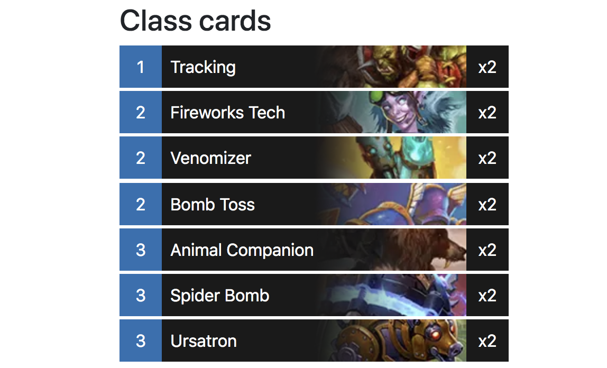

## Table of Contents

1. [Presentation of the problem](#presentation-of-the-problem)
1. [Why optimize?](#why-optimize-your-images)
1. [Image formats](#image-formats)
1. [Image fallbacks with the picture element](#image-fallback-with-the-picture-element)
1. [Compressing and converting](#compressing-and-converting-our-images)
1. [Scaling up](#scaling-up)
1. [Hosting](#hosting-our-images)
1. [Potential improvements](#potential-improvements)
1. [Conclusion](#conclusion)

## Presentation of the problem

For the last few weeks, I've been working on a website that contains many small images.
Here is an example page:



And here's a closeup of an individual image:


As part of the project setup, I downloaded around 2000 external images onto my laptop.
Before I could start using in my site, I needed to do two things:

1. Optimize the images
2. Host the images

## Why optimize your images?

The 2019 ["State of the Web" report](https://httparchive.org/reports/state-of-the-web) by the [HTTP Archive](https://httparchive.org/about) found that the average website contains almost 900 KB of images - about half of the average page weight.
Additionally, in Google VP Marissa Meyer's keynote speech at Web 2.0, she shared Google's finding that a [half-second increase in page load time led to a 20% drop in traffic](http://glinden.blogspot.com/2006/11/marissa-mayer-at-web-20.html).

Every byte that you can shave off an image is one less byte on your monthly bandwidth bill and one less byte that your user has to download.
Everybody wins!

## Image formats

The two most important steps to optimizing images are picking the right format and serving the correct resolution to client devices.
Luckily, as our images are very small, we can serve the same resolution for mobile desktop and just concentrate on picking the format.

That said, there are three principal general-purpose image formats:

1. JPEG
1. PNG
1. WEBP

While WEBP is the best format, marrying the features of both JPEG and PNG with a smaller file size, it's not yet supported by Safari or Internet Explorer.
To help you pick which format(s) to use, ask yourself the following questions in order:

1. Do you only support Firefox/Chrome? Use WEBP.
1. Do your images contain transparent sections? Use WEBP with a PNG fallback (we'll talk about fallback implementation in the next section).
1. Are your images visually complex, such as photographs or artwork? Use WEBP with a JPEG fallback.
1. Otherwise, use WEBP with a PNG fallback.

This might seem a little abstract, so let's walk through these rules using our example image from earlier:


1. I support Safari (you probably do too!), so we'll move onto the next question.
1. Our images _do_ have transparent sections.
   WEBP with a PNG fallback it is!

## Image fallback with the picture element

In the previous section we decided that a WEBP image with a PNG fallback was the way to go.
To implement the fallback behavior, we're going to make use of the [picture element](https://developer.mozilla.org/en-US/docs/Web/HTML/Element/picture).
Here's what the markup will look like:

<!-- prettier-ignore -->
```html
<picture>
  <source
    srcset="/TRL_128.webp"
    type="image/webp" />
  
</picture>
```

Let's dig into what's happening here.
When a browser encounters a picture tag, it evaluates its contents sequentially, top to bottom.
The first `source` or `img` element with a matching type and media query will be the image that's shown.

In the case of Chrome or Firefox, the browser will read the `source` element; as these browsers support WEBP and there is no media query, it will immediately display this image.

In Safari's case, as the browser does not support WEBP, the `source` will be discarded and the fallback `img` element will be used.

Finally, we have the plucky 6% of Canadian users that navigate with Internet Explorer.
While IE does not understand the `picture` or `source` element, it will skip to the `img` element and display that.
Since the `img` contains our fallback PNG, this is exactly the behavior we want.

As I mentioned in the image format section, our situation is a bit unique, in that we are always serving the same resolution for our images.
If we had bigger images for which we were exporting multiple sizes, we would need to combine the picture element with the srcset attribute.
This technique is discussed in [MDN's article on responsive images](https://developer.mozilla.org/en-US/docs/Learn/HTML/Multimedia_and_embedding/Responsive_images).

## Compressing and converting our images

Let's actually do some stuff!
For each of our 2000 original images (in PNG format), we're going to do two things:

1. Lossily compress the source image, keeping the PNG format
1. Convert the original image from to a lossy WEBP

My work computer is a Mac, so I'll be using tools available on that platform.
For the PNG compression, this will be [ImageOptim-Cli](https://github.com/JamieMason/ImageOptim-CLI#cloud-installation) and [ImageAlpha](https://pngmini.com/).
The WEBP compression will be handled by [ImageMagick](https://imagemagick.org/index.php).

Here's an example for both the PNG and WEBP formats:

```bash
$ cp original.png compressed.png
$ imageoptim --imagealpha --quality 50 compressed.png
$ mogrify -format WEBP original.png
$ mv original.webp compressed.webp
$ ls -lh
4.9K compressed.png
2.6K compressed.webp
16K  original.png
```

A 69% savings for the compressed PNG and 84% for the WEBP.
Wow!
Now, a comparison of image quality.
Here is the original image:


The compressed PNG:


And the WEBP (best viewed in Chrome/Firefox):


To my (near-sighted) eyes, the three are identical.
We did it!

## Scaling up

So far we've converted one out of 2000 images.
While we _could_ type out the command for the remaining 1999, some would say that this isn't the best use of our time, and I would tend to agree.
Instead, we're going to rely on two classic CLI tools: `find` and `xargs`.

To get started, I'm going to make a copy of the directory containing my source images:

```bash
$ cp -R originals/ compressed/
```

Next, I'm going to use some find/xarg magic with our previous mogrify command to convert all the images in the `compressed/` directory to WEBP:

```bash
$ NUM_CORES="$(getconf _NPROCESSORS_ONLN)"
$ find compressed/ -iname "*.png" -print0 | \
  xargs -0 -n 1 -P $NUM_CORES \
  mogrify -format webp
```

Let's break down the second command line by line.

We start by grabbing making a list of all the PNG files in the `compressed/` directory:

```
find compressed/ -iname "*.png" -print0
```

- The `-print0` flag tells find to output a null-delimited list of strings, instead of a newline-delimited list.
  This allows find to handle filenames that contain newlines.

The output of find - our list of PNG files - is then piped into xargs:

```
xargs -0 -n 1 -P $NUM_CORES \
mogrify -format webp
```

- `-0` matches the `-print0` option of find, telling xargs to expect a null byte as a delimiter
- `-n 1` tells xargs to pair exactly one filename to each command.
  For example, if we set `-n 2`, then the executed command would be `mogrify -format webp file1.png file2.png`.

  If you're running a command that can accept an arbitrary number files as an argument and has a non-negligible startup time, increasing this number will speed up the overall execution time.
  Since mogrify only takes one file as an argument, we have to specify one filename at a time here.

- `-P $NUM_CORES` tells xargs to use all the cores of our machine (eight, in my case).
  Note that the `$NUM_CORES` was set in a previous line to the value of `getconf _NPROCESSORS_ONLN`.

For my folder of 2000 (small) images, it took six seconds to convert them all to WEBP.

Next up is the PNG compression.
While `imageoptim` _does_ take an arbitrary number of arguments as input, trying to execute it on all 2000 images caused it to hang when I tried.
Instead, we'll reuse our previous command, with two changes:

1. `imageoptim` takes about a second to start, so we will go ahead and bump `-n` to 20.
1. You can't concurrently run multiple instances of `imageoptim`, so we'll turn off the `-P` option.
   For posterity, here is the command:

```
$ NUM_CORES="$(getconf _NPROCESSORS_ONLN)"
$ find compressed/ -iname "*.png" -print0 | \
  xargs -0 -n 20 \
  imageoptim --imagealpha --quality 50
```

This step took considerably longer than the WEBP conversion - over twelve minutes on my computer.
Once it's completed, though, you'll have a directory full of svelte PNGs and WEBPs!
What next?

## Hosting our images

Time to make our images public!
We're going to be using Amazon S3 for this.
There are two prerequisites:

- [An activated AWS account](https://aws.amazon.com/premiumsupport/knowledge-center/create-and-activate-aws-account/) (you'll need your key id and secret key ready at hand)
- [The AWS CLI](https://aws.amazon.com/cli/)

First, configure the AWS CLI with

```bash
$ aws configure
```

This will prompt you to enter your account key id and secret key and will automatically authenticate us for the following commands.

Next, let's create a new S3 bucket.
For this article, we'll use a bucket named `image-optimization-blog-post`.

```bash
$ BUCKET_NAME=image-optimization-blog-post
$ aws s3 mb s3://$BUCKET_NAME
make_bucket: image-optimization-blog-post
```

Next, we're going to update the bucket settings to make all the objects publicly-readable.
First, let's create a file called `policy.json` and fill in its contents:

```bash
$ cat policy.json
{
    "Version": "2012-10-17",
    "Statement": [
        {
            "Sid": "AddPerm",
            "Effect": "Allow",
            "Principal": "*",
            "Action": "s3:GetObject",
            "Resource": "arn:aws:s3:::image-optimization-blog-post/*"
        }
    ]
}
```

Make sure to fill in the value of `$BUCKET_NAME` in the "Resource" line.
Now, let's apply the policy to our newly-created bucket:

```bash
$ POLICY_PATH=$(realpath policy.json)
$ aws s3api put-bucket-policy --bucket $BUCKET_NAME --policy file://$POLICY_PATH
```

Time to upload our images!
I'm going to sync the `compressed/` folder we created earlier to the `assets/images/` folder of our bucket.
We'll start with a dryrun to make sure that everything looks okay:

```bash
$ PUBLIC_PATH=assets/images
$ aws s3 sync compressed/ s3://$BUCKET_NAME/$PUBLIC_PATH --dryrun
(dryrun) upload: compressed/ROT_114.png to s3://image-optimization-blog-post/ROT_114.png
(dryrun) upload: compressed/ROT_114.webp to s3://image-optimization-blog-post/ROT_114.webp
...
```

Check over the output carefully to make sure everything is getting put where it's supposed to.
Once you're satisfied of the result, we'll rerun the previous command without `--dryrun`, uploading our images for real:

```bash
$ aws s3 sync compressed/ s3://$BUCKET_NAME/$PUBLIC_PATH
upload: compressed/ROT_114.webp to s3://image-optimization-blog-post/assets/images/ROT_114.webp
upload: compressed/ROT_114.webp to s3://image-optimization-blog-post/assets/images/ROT_114.webp
...
```

Let's open one of our images to make sure that everything went well:

```bash
$ IMAGE_NAME=$(ls compressed/ | head -1)
$ open https://$BUCKET_NAME.s3.amazonaws.com/$PUBLIC_PATH/$IMAGE_NAME
```

If you see your image, you're officially done with your image pipeline.
Congratulations!

## Potential improvements

Here's a list of improvements we could have implemented throughout workflow, in no particular order:

- It wasn't necessary in our case, but generally you want to output several resolutions for each images, to save bandwidth for mobile users.
  MDN has a [comprehensive article](https://developer.mozilla.org/en-US/docs/Learn/HTML/Multimedia_and_embedding/Responsive_images) of what the HTML markup for that would look like, complete with a [live example](https://mdn.github.io/learning-area/html/multimedia-and-embedding/responsive-images/responsive.html).
  [Martin Melinda also published an article](https://hackernoon.com/save-time-by-transforming-images-in-the-command-line-c63c83e53b17) that discusses how to create the various resolutions.
- All of the shell commands and image processing in this article took place on my local machine.
  While that's very convenient, it's not always a possibility.
  Due to security policies or the number of images involved, it might be necessary to `ssh` in to the machine where the images reside and run your commands there.
- We used [ImageOptim](https://imageoptim.com/mac) to compress our PNGs; however, ImageOptim is only available on OS X.
  I _believe_ that ImageOptim uses [zopflipng](https://github.com/imagemin/zopflipng-bin) as the underlying compressor, so you could look into that if you're working in a Linux environment.
  This would likely be much faster than using ImageOptim, at the cost of more complicated setup and usage.
- We used our own AWS account to interact with the image bucket.
  The best practice for AWS would have been to [create a separate IAM user](https://docs.aws.amazon.com/IAM/latest/UserGuide/id_users_create.html) that only has permissions for that bucket, and to do everything with that user's credentials.
- The images I used on my site are small enough that I could have considered [inlining them into the image src attribute](http://www.websiteoptimization.com/speed/tweak/inline-images/).
  This would have dramatically cut down on the number of the page requests as well eliminating a round-trip call for the images.
  However, this prevents the browser from caching the images and increases the cost of fallback images.
  Make sure you evaluate your project's needs before pursuing this approach.
- If you run Lighthouse on a page with these images, it will tell you that you need to

  > Serve static assets with an efficient cache policy

  By default, S3 does not add a `Cache-Control` header to objects.
  To allow browsers to cache your images, I would suggest that you do two things:

  1. Rename the images to include the MD5 hash of their contents
  2. Resync your files, this time using the `--metadata` flag to add the following value: `Cache-Control: max-age=31536000`.

  Whenever you update the files, their filename will change to reflect their new contents.
  This allows instant cache validation and is the reason we can use such a long cache policy in the second step.

## Conclusion

You have now officially finished my image pipeline guide.
Thanks for sticking through to the end, and I hope you learned something!
