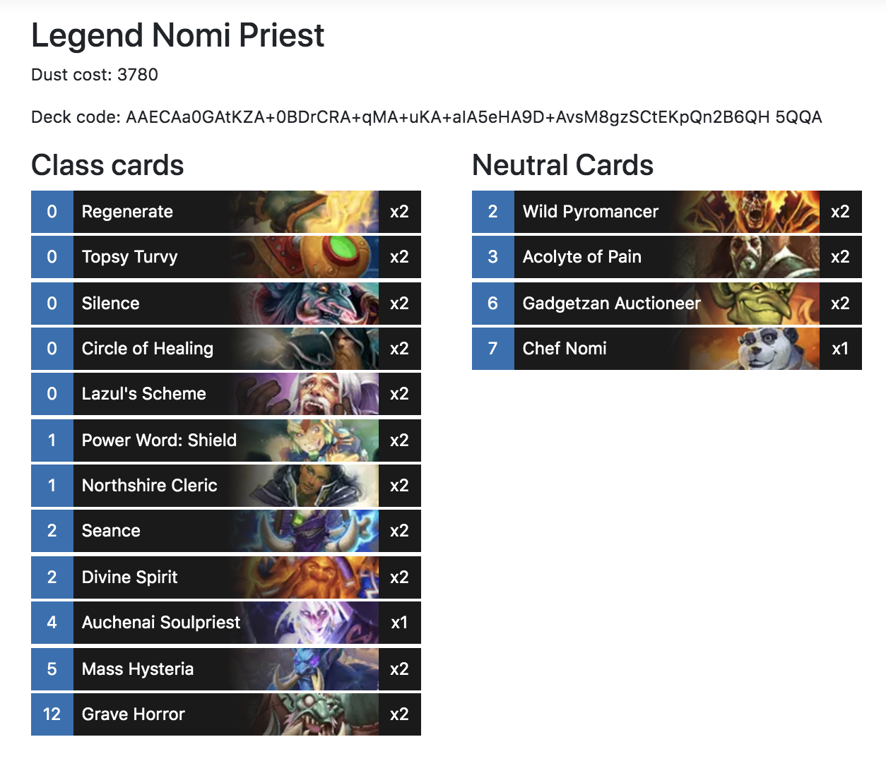

## Table of Contents

1. [Presentation of problem](#presentation-of-problem)
1. [Why optimize?](#why-optimize)
1. [Image formats](#image-formats)
1. [Image fallbacks with the picture element](#image-fallback-with-the-picture-element)
1. [Compressing and converting our images](#compressing-and-converting-our-images)
1. [Scaling up](#scaling-up)
1. Hosting the images on S3
1. Potential improvements

## Presentation of problem

For the last few weeks I've been working on a website that contains many small images.
Here is an example page:



And here's a closeup of an individual image:


As part of the project setup, I downloaded the ~2000 images from a 3rd party site onto my laptop.
Before I could dive into the CSS and start integrating them into the page, however, I needed to do two things:

1. Optimize the images
2. Find a place to host the images.

## Why optimize?

The 2019 ["State of the Web" report](https://httparchive.org/reports/state-of-the-web) by the [HTTP Archive](https://httparchive.org/about) found that the average website contains almost 900 KB of images - almost half of the average page weight.
Additionally, in Google VP Marissa Meyer's keynote speech at Web 2.0, she shares Google's finding that a [half-second increase in page load time led to a 20% drop in traffic](http://glinden.blogspot.com/2006/11/marissa-mayer-at-web-20.html).

Every byte that you can shave off an image is one less byte on your monthly bandwidth bill and one less byte that your user has to wait to download.
Everybody wins!

## Image formats

The two most important steps to optimizing images are picking the right format and serving the correct resolution for the device.
Luckily, as our images are very small, we can serve the same resolution for mobile desktop and just concentrate on picking the format.

There are three main image formats:

1. `jpeg`
1. `png`
1. `webp` (the new kid on the block)

Choosing between the various formats basically comes down to two things: the image content and the browsers you need to support.
There's a lot written on this subject, but I'm going to boil it down to four rules of thumb:

- If your image contains partially transparent sections, `png` and `webp` are your only choices as `jpeg` doesn't support opacity.
- If you need to support Safari or Internet Explorer, you cannot use `webp` without a fallback (more on that later).
- If your image is computer-generated (such as a screenshot or a diagram), then prefer `png` over `jpeg`; if the image is a photograph or artwork, `jpeg` is preferred (`webp` works equally well for both).

And finally, `webp` is always preferred.

This might seem a little abstract, so let's walk through these rules using our example image from earlier:


1. I support Safari (you probably do too!), so we're going to need a `jpeg` or `png` fallback in addition to `webp`.
1. The image is fairly complex visually, which would normally indicate `jpeg`; however, the left part of the image contains a transparent gradient, so we have to use `png`.

Taking those two points into account, we come to the conclusion that our ideal image would `webp`, falling back to a `png` if needed due to browser incompatibility.

## Image fallback with the `picture` element

In the previous section we decided that a `webp` image with a `png` fallback was the way to go.
To implement this logic, we're going to make use of the [picture element](https://developer.mozilla.org/en-US/docs/Web/HTML/Element/picture).
Here's what our final product will (potentially) look like:

```html
<picture>
  <source srcset="/tiles/TRL_128.webp" type="image/webp" />
  
</picture>
```

Let's dig into what's happening here.
When a browser encounters a `picture` tag, it evaluates its contents sequentially, top to bottom.
The first `source` or `img` element with a matching `type` and `media` will be the image that's shown.

In the case of Chrome or Firefox, the browser will read the `source` element; as these browsers support `webp` and there is no `media` attribute, it will immediately display this image.

In Safari's case, as the browser does not support `webp`, the `source` will be discarded and the fallback `img` element will be used.

Finally, we have the plucky 6% of Canadian users that navigate with Internet Explorer.
While IE does not understand the `picture` or `source` element, it will skip to the `img` element and display that.
Since the `img` contains our fallback `png`, this is exactly the behavior we want.

As I mentioned in the image format section, our situation is a bit unique, in that we are always serving the same resolution for our images.
If we had bigger images for which we were exporting multiple sizes, we would need to combine the picture element with the srcset attribute.
This technique is discussed in [MDN's article on responsive images](https://developer.mozilla.org/en-US/docs/Learn/HTML/Multimedia_and_embedding/Responsive_images).

## Compressing and converting our images

Time to actually do some stuff!
For each of our 2000 original images (in png format), we're going to do two things:

1. Lossily compress the source image, keeping the png format
1. Convert the original image from to a lossy `webp`

My work computer is a Mac, so I'll be using tools available on that platform.
For the png compression, this will be [ImageOptim-Cli](https://github.com/JamieMason/ImageOptim-CLI#cloud-installation) and [ImageAlpha](https://pngmini.com/).
The webp compression will be handled by [ImageMagick](https://imagemagick.org/index.php).

Here's an example for both the png and webp formats:

```bash
$ cp original.png compressed.png
$ imageoptim --imagealpha --quality 50 --no-stats compressed.png
$ mogrify -format webp original.png
$ mv original.webp compressed.webp
$ ls -lh
total 56
-rw-r--r--  1 ahammes  staff   4.9K Jun  1 23:23 compressed.png
-rw-r--r--  1 ahammes  staff   2.6K Jun  1 23:23 compressed.webp
-rw-r--r--@ 1 ahammes  staff    16K Jun  1 23:14 original.png
```

A 69% savings for the compressed png and 84% for the webp.
Wow!
Now, a comparison of image quality.
Here is the original image:


The compressed png:


And the webp (best viewed in Chrome/Firefox):


To my (near-sighted) eyes, the three are identical.
We did it!

## Scaling Up

So far we've converted 1/2000 images.
While we _could_ type out the command for all of the 2000, some would say that this isn't the best use of our time, and I would tend to agree.
Instead, we're going to rely on two CLI tools: `find` and `xargs`.

To get started, I'm going to make a copy of the directory containing my source images:

```bash
$ cp -R originals/ compressed/
```

Now, we're going to use some `find`/`xarg` magic with our previous `mogrify` command to convert all the images in the `compressed/` directory to `webp`:

```bash
$ NUM_CORES="$(getconf _NPROCESSORS_ONLN)"
$ find compressed/ -iname "*.png" -print0 | \
  xargs -0 -n 1 -P $NUM_CORES \
  mogrify -format webp
```

Let's break down the second command line by line.

We start by grabbing making a list of all the png files in the `compressed/` directory:

```
find compressed/ -iname "*.png" -print0
```

- The `-print0` flag tells `find` to output a `null`-delimited list of strings, instead of a newline-delimited list.
  This allows `find` to handle filenames that contain newlines.

The output of `find` - our list of png files - is then piped into `xargs`:

```
xargs -0 -n 1 -P $NUM_CORES \
mogrify -format webp
```

- `-0` matches the `-print0` option of `find`, telling `xargs` to expect a null byte as a delimiter
- `-n 1` tells `xargs` to pair exactly one filename to each command.
  If you want to run a command that can accept an arbitrary number files as an argument and has a non-negligible startup time, increasing this number will speed up the overall execution time.
  Since `mogrify` only takes one file as an argument, we have to specify one filename at a time here.
- `-P $NUM_CORES` tells `xargs` to use all the cores of our machine (eight, in my case).
  Note that the `$NUM_CORES` was set in a previous line to the value of `getconf _NPROCESSORS_ONLN`.

For my folder of 2000 (small) images, it took six seconds to convert them all to webp.

Next up is the png compression.
While `imageoptim` _does_ take an arbitrary number of arguments as input, trying to execute it on all 2000 images caused it to hang when I tried.
Instead, we'll reuse our previous command, with two changes:

1. `imageoptim` takes about a second to start, so we will go ahead and bump `-n` to 20.
1. You can't concurrently run multiple instances of `imageoptim`, so we'll turn off the `-P` option.
   For posterity, here is the command:

```
$ NUM_CORES="$(getconf _NPROCESSORS_ONLN)"
$ find compressed/ -iname "*.png" -print0 | \
  xargs -0 -n 20 \
  imageoptim --imagealpha --quality 50
```

This step took considerably longer than the webp conversion - over twelve minutes on my computer.
Once it's completed, though, you'll have a directory full of juicily compressed pngs and webps!
What next?
