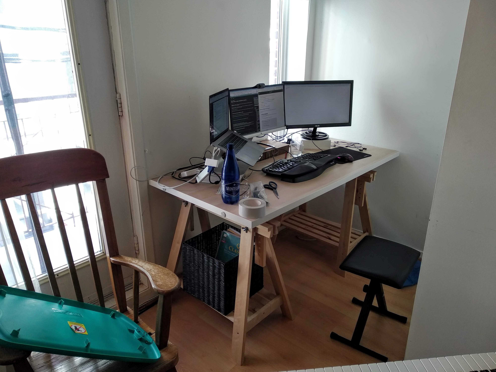
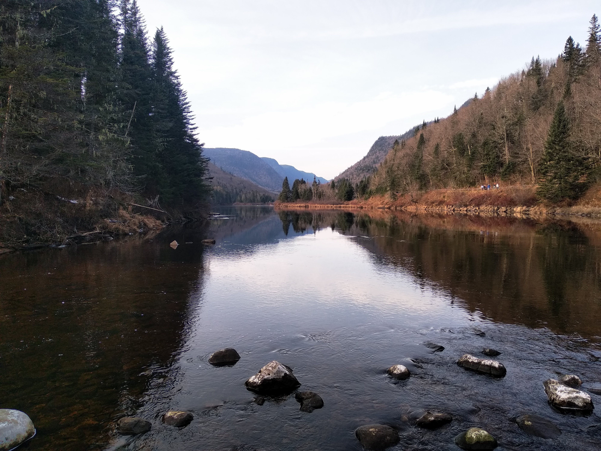

+++
title = "Adam - January 2021"
+++

# Adam's Cousin Letter, January 2021

Hey family!
I missed the deadline for my cousin letter back in August, but figured that later is better than never.
It goes without saying, but 2020 has been a crazy year, and putting it in writing has just reinforced that fact.
Life has had its ups and downs over the last twelve months, but the key takeaways are: I've kept my job, I'm in good health, and I'm with my family.

With the introduction aside, let's get going!

## Beginning of the Pandemic

The week of March 9th was when I first started paying attention to Covid.
That Friday, work announced that we would all be working remotely for an indefinite period, and that we should pack up all our belongings and equipment to bring with us home.
I remember sitting around with my colleagues after the announcement, talking about what would happen over the next few months. The next day (Saturday), the Quebec government announced that everything but essential services would be shut down that Monday.

It hit me that I might be working from home for a _long_ time, and that my apartment wasn't setup for that eventuality.
I remembered that a coworker had mentioned that he was selling his IKEA desk, and pounced on the opportunity.
He was nice to drive the desk over after I bought it (I don't have a car in Quebec), and Sunday night was spent setting up a corner of my apartment for work:

Boy, was I lucky to have jumped on that opportunity as quickly as I did.
Since that Monday, March 16th, my company has been 100% remote.
I haven't been physically in office in over nine months.

## Spring Months

All non-essential in-person businesses (and schools!) stayed closed in Quebec until mid-May.
For March and most of April, I stayed confined in my apartment and didn't see anyone in person.
I plunged myself into my work during that time, did Zoom happy hours with friends, and got the most possible value out my Netflix subscription.

Despite that, the fact that I was living alone and not seeing people really took a toll on me.
It was kind of a negative cycle, where I was feeling lonely, and the negative feelings that came with that made it harder for me to reach out and make the effort to connect with friends.
Luckily, mom and dad were always a phone call away.

On my birthday, May 4th, I wasn't planning on doing much.
A friend wrote me and asked if I would be home at four that afternoon, to which I said yes.
As I waited outside for him, my friend Silvia walked by, said hello and gave me a small plant for my birthday.
Just as she had left, another friend Dominique stopped by with a small cake.
After she departed, another friend happened to be in the neighborhood.
Then another friend ran into me.

Lest you think I have any brains, it took _8_ friends stopping by to see me before I realized that they had managed to plan me a surprise birthday party while simultaneously respecting the social distancing guidelines.
I cried with laughter when I finally caught on.
That was definitely my favorite birthday I've experienced, and along with the warm weather that was commencing, helped bring me break out of my funk.

<figure>
    
    <figcaption>Birthday plants, aka April showers bring May flowers</figcaption>
</figure>

## Summertime

As June and July rolled by, Quebec dropped down below 100 cases a day, and people started seeing each other a lot more.
I joined a volleyball group that played in a nearby park, and had a fun time pretending I could spike over the net.

Those months of confinement in March and April had made me itchy to go outside, and once it had warmed up, I started getting out of the downtown area around my apartment and exploring some of the area around Quebec City

First up was a trip to the neighboring city of Wendake:

<figure>
    
    <figcaption>My friend Fernanda and I at <a href="https://gowaterfalling.com/waterfalls/kabirkouba.shtml">Kabir Kuba Falls</a></figcaption>
</figure>

My friend Heloïse introduced me to a wonderful sunbathing/actual bathing spot called "Les roches plates", literally "The flat rocks" in English:

And I went canoeing for the first time, on the St. Charles River:

## New Friends, New Activities

For my first two years in Quebec City, almost of all my friends were made through swing dancing or work.
It's very hard to make friends in a new town, where people have had the same social circle their whole life and don't feel any pressing need to expand it.
As such, my social activities largely revolved around dance events (classes, troupe practices, etc.) and work social events that the company would organize.

Towards the end of 2018, though, this started to change, as I fell in with a board-game group that played weekly.
We would all gather at someone's house, crack open a few beers, and play until late in the night.
The games we played were typically collaborative, or team-based, as we mostly were just there for the company weren't that competitive.
It was nice to meet a new group of people and it added some diversity in my weeks.

As I grew closer with the group, we started to spend time together outside of our board game nights, and I quickly realized what had originally brought the group together: They had all studied forestry at the same university.
As such, their weekend activities leaned towards the outdoorsy side, and I found myself often dragged along on bike rides and hiking trips.

One of my first bike trips with the group was to [Montmorency Falls](https://en.wikipedia.org/wiki/Montmorency_Falls).
It wasn't that far away, maybe 10 miles one-way, but there was a big change in elevation as we rode from sea-level to the top of the Montmorency River.
Needless to say, I was gasping for breath when we finally arrived.
However, the ride wasn't the only thing that took my breath away, as I found myself gaping at the view from the top of the falls:

<video controls src="./montmorency-falls.mp4"></video>

<figure>
    
    <figcaption>The smiling faces of three bicyclists who get to coast downhill all the way home</figcaption>
</figure>

Later in the year, on the last day warm enough to wear shorts, we drove out to the Jacques-Cartier National Park, 30 miles north of Quebec City.
We hiked one of the easier trails, without too much up-and-down.
Hopefully we can return in 2021 to challenge ourselves
The backdrop of the park let me pretend to be a much better photographer than I actually am:

<figure>
    
    <figcaption>The view at the start of the trail</figcaption>
</figure>

<figure>
    
    <figcaption>Peeking through the tree-tops, near the top of the trail</figcaption>
</figure>

<figure>
    
    <figcaption>Trying to plot a way down through the mud</figcaption>
</figure>

## The Return Home

In early January, I applied to renew my work visa in Quebec.
Normally, this is a process that takes around three months to finish, but due to a certain global event, treatment of work visas came to a halt for most of the year.
Without a work visa, I could stay and work in Canada, but as soon as I left, I would lose the right to re-enter.
There wasn't anything I could do but wait for my case to be treated.

Then, on December 2nd, Christmas arrived early!
I received my work visa in my mail, meaning I could now freely leave the country.
I immediately bought plane tickets back to Iowa, and flew into Cedar Rapids on December 11th.
My parents had dropped off a car for me to use at the airport, and I drove through a snowstorm to an apartment John had ready for me where I could do my quarantine:

<figure>
    
    <figcaption>John was even kind enough to provide me with a Hawkeye pillow-case!</figcaption>
</figure>

After 10 days of isolation and a negative covid test, I finally got to see my family, after a year of waiting.
Best Christmas present ever 🙂

You've made it to the end!
Thank you for reading all the way through.
Don't let this cousin letter get lonely in 2021 - I want to know what's going on in all of your lives as well!

\- Adam
